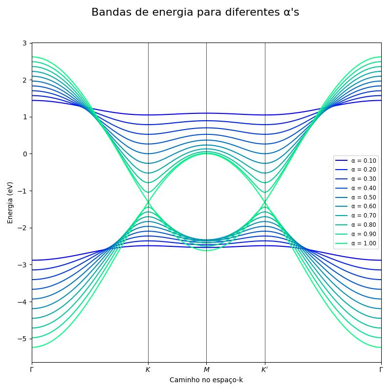

# MOS2-vacancy

**Objetivo;**
O objetivo desse código é estudar a influência da densidade de vacâncias no band gap de MoS₂. 

 O notebook [`Bandas.ipynb`](Bandas.ipynb) possui a implemntação em alguns comentários do estudo em questão.
  

### Exemplo
Aqui está um exemplo de resultado que você obterá com o código de [`Bandas.ipynb`](Bandas.ipynb).

### Contribuições
Contribuições são bem-vindas! Por favor, siga estes passos:

- Fork o repositório
- Crie um novo branch (`git checkout -b feature-branch`)
- Faça commit das suas mudanças (`git commit -am 'Adicionar nova feature'`)
- Faça push para o branch (`git push origin feature-branch`)
- Crie um novo `Pull Request`

## Contato
Se você tiver alguma pergunta ou sugestão, me contate:
- sergio23040@ilum.cnpem.br

## Referências
- [1] Crasto de Lima, F., & Fazzio, A. (2021). At the verge of topology: vacancy-driven quantum spin Hall in trivial insulators. Nano Letters, 21(22), 9398-9402.
- [2] Python Tight Binding. (2024). Documentação da PythTB. Retirado em 09 de novembro de 2024. Aceso em: https://www.physics.rutgers.edu/pythtb/
  
Obrigado por estudar o meu repositório! Happy Coding!
